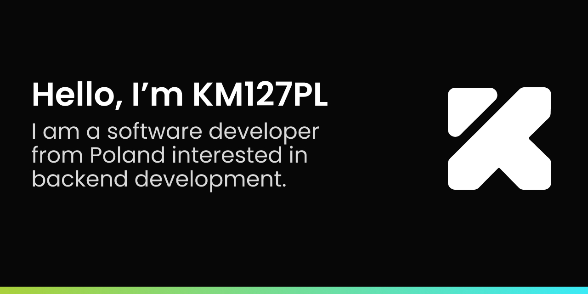

## About me
* Backend software developer 🖥
* Studying Computer Science 
* Hoping to be an actual developer someday!

## What am I up to?
* I am currently working on:
    * My own website! - [km127pl.us](https://github.com/km127pl/km127pl.us)
    * CelestialDungeons - a plugin that generates random, rogue-like dungeons for players to explore 
    * Rusteware - a warehouse inventory management software for tracking products.
* One day I am hoping to
    * Learn rustlang
    * Create my own operating system
    * Use linux as my daily-driver

## Contact
You can contact me in the following ways:
* By email [km127pl@gmail.com](mailto:km127pl@gmail.com)
* On discord `KM127PL#4630`
* On matrix/element `@km127pl:matrix.org`

## 📊 GitHub Stats:
 
 

## 🏆 GitHub Trophies

### ✍️ Random Dev Quote

